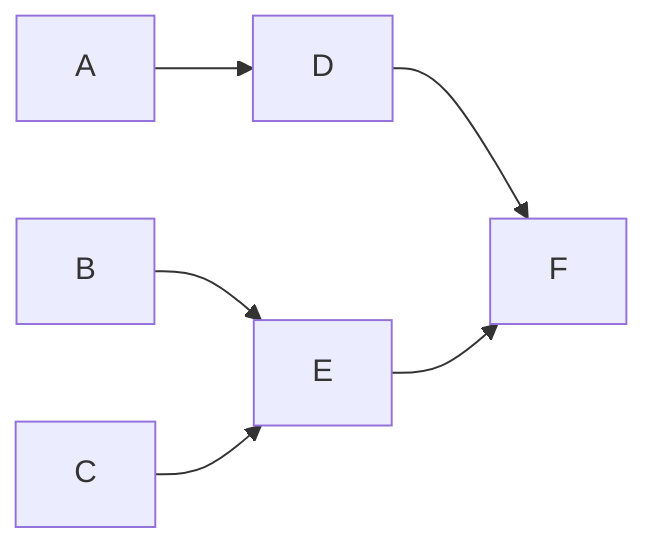

# Görev Bağımlılık Zamanlayıcı

## Genel Bakış
Bu proje, bağımlılıkları olan bir dizi görev için minimum tamamlanma süresini belirlemeye yardımcı olur. Görevlerin en uygun yürütme sırasını hesaplayan bir fonksiyon içerir ve ana programda bu işlemi gerçekleştiren bir örnek sunulmaktadır.

## Özellikler
- Tüm görevleri tamamlamak için gereken minimum süreyi hesaplar.
- Görev yürütme sırasının bağımlılıklara uygun olup olmadığını doğrular.
- Kahn Algoritması kullanılarak topolojik sıralama gerçekleştirir.

## Neden Bu Çözüm Seçildi?
Görev bağımlılıklarını yönetmek ve yürütme sırasını belirlemek için **DAG (Directed Acyclic Graph - Yönlendirilmiş Çizgesel Döngüsüz Grafik)** yaklaşımı gereklidir. Döngüsüz bir grafik olduğu için, görevlerin bağımlılıklarına uygun şekilde sıralanması ve toplam tamamlanma süresinin hesaplanması gerekir. Bunun için **topolojik sıralama** kullanılmaktadır.

## Neden Kahn Algoritması Seçildi?
**Kahn Algoritması**, bir grafiğin **topolojik sıralamasını** hesaplamak için kullanılan etkili bir yöntemdir. Bu algoritma özellikle bağımlılık ilişkileri olan görevler için uygundur çünkü:

1. **O(V + E) Zaman Karmaşıklığı**: Görevlerin bağımlılıklarının sıralanmasını en verimli şekilde sağlar.
2. **Döngü Kontrolü**: Eğer bağımlılıklar arasında bir döngü oluşursa, bu algoritma bunu tespit edebilir ve işlem durdurulabilir.
3. **Basit ve Etkili**: Bağımsız görevleri (bağımlılığı olmayan) önce işleyerek en uygun sıralamayı elde eder.

## Kurulum
Bu projeyi çalıştırmak için **Go** kurulu olmalıdır.

1. Depoyu klonlayın:
   ```sh
   git clone <repository-url>
   cd <repository-folder>
   ```
2. Programı çalıştırın:
   ```sh
   go run main.go
   ```

## Kullanım
Yeni görevler ve bağımlılıkları tanımlamak için `main.go` dosyasındaki `tasks` haritasını değiştirebilirsiniz. Program çalıştırıldığında minimum tamamlanma süresi ve geçerli görev sırası ekrana yazdırılacaktır.

## Kod Yapısı
- `minCompletionTime(tasks map[string]Task) (int, []string)`: Minimum süreyi ve görev sırasını hesaplar.
- `main()`: Görevleri tanımlar ve `minCompletionTime` fonksiyonunu çalıştırarak sonuçları ekrana yazdırır.

## Örnek
Aşağıdaki görevler için:

| Görev | Süre | Bağımlılıklar |
|------|------|--------------|
| A    | 3    | Yok          |
| B    | 2    | Yok          |
| C    | 4    | Yok          |
| D    | 5    | A            |
| E    | 2    | B, C         |
| F    | 3    | D, E         |


#### Bağımlılık Grafiği


Fonksiyonun çıktısı şu şekilde olmalıdır:
- **Minimum Tamamlanma Süresi:** `11`
- **Geçerli Yürütme Sırası:** Örneğin `[A, B, C, D, E, F]`


