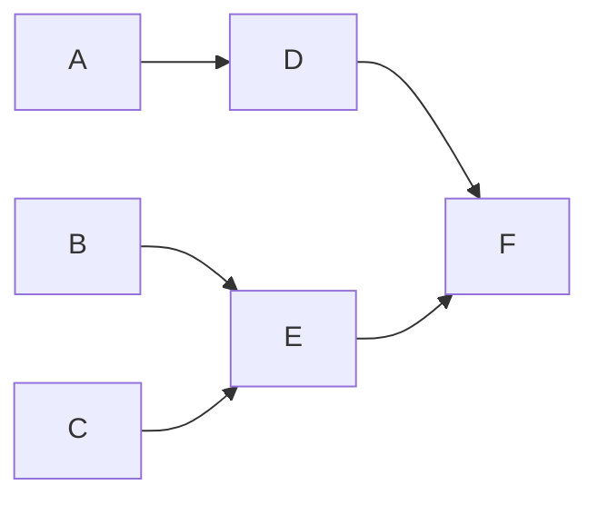

# Görev Bağımlılık Zamanlayıcı

## Genel Bakış
Bu proje, bağımlılıkları olan bir dizi görevin minimum tamamlanma süresini hesaplamaya yardımcı olur. İki farklı çözüm sunulmaktadır:

1. **Single Worker (Tek İşçi)**: Aynı anda yalnızca bir görevin işlendiği senaryo.
2. **Multiprocessing (Çoklu İşlemci)**: Birden fazla görevin paralel olarak işlendiği senaryo.

Bu çözümler, görevlerin en uygun yürütme sırasını hesaplayan fonksiyonlar içerir ve ana programda bu işlemi gerçekleştiren örnekler sunulmaktadır.

## Çözümler ve Farkları
### **1. Single Worker (Tek İşçi) Çözümü**
- Görevler **sıralı olarak** çalıştırılır.
- Aynı anda yalnızca **bir görev işlenebilir**.
- En kısa sürede tamamlanabilecek görev öncelikli olarak seçilir.
- **Kullanım Alanı**: Tek iş parçacıklı sistemler veya sırayla çalışması gereken iş akışları.

### **2. Multiprocessing (Çoklu İşlemci) Çözümü**
- Görevler **aynı anda birden fazla işlemci tarafından paralel olarak** yürütülebilir.
- Bağımsız görevler **eş zamanlı** olarak işlenebilir, bu da tamamlanma süresini kısaltır.
- **Kullanım Alanı**: Çok çekirdekli sistemler, yüksek performans gerektiren görev zamanlamaları.

## Neden Kahn Algoritması Seçildi?
Görev bağımlılıklarını yönetmek ve yürütme sırasını belirlemek için **DAG (Directed Acyclic Graph - Yönlendirilmiş Çizgesel Döngüsüz Grafik)** yaklaşımı gereklidir. Bu yapıyı sıralamak için **Kahn Algoritması** kullanılır çünkü:

1. **O(V + E) Zaman Karmaşıklığı**: Görevlerin bağımlılıklarını en verimli şekilde sıralar.
2. **Döngü Kontrolü**: Bağımlılıklar arasında döngü olup olmadığını tespit edebilir.
3. **Basit ve Etkili**: Bağımsız görevleri önce çalıştırarak en uygun sıralamayı oluşturur.

## Kurulum
Bu projeyi çalıştırmak için **Go** kurulu olmalıdır.

1. Depoyu klonlayın:
   ```sh
   git clone https://github.com/gkhancobanoglu/young-talent-case.git
   ```
2. Single Worker versiyonunu çalıştırın:
   ```sh
   cd singleworker
   go run main.go
   ```
3. Multiprocessing versiyonunu çalıştırın:
   ```sh
   cd multiprocessing
   go run main.go
   ```

## Kullanım
Yeni görevler ve bağımlılıkları tanımlamak için `main.go` dosyasındaki `tasks` haritasını değiştirebilirsiniz. Program çalıştırıldığında minimum tamamlanma süresi ve geçerli görev sırası ekrana yazdırılacaktır.

## Kod Yapısı
- **Single Worker**:
   - `singleWorkerSchedule(tasks map[string]Task) (int, []string)`: Minimum süreyi ve görev sırasını hesaplar.
   - `main()`: Görevleri tanımlar ve `singleWorkerSchedule` fonksiyonunu çalıştırarak sonucu ekrana yazdırır.

- **Multiprocessing**:
   - `multiProcessingSchedule(tasks map[string]Task) (int, []string)`: Paralel olarak çalıştırılacak görevleri planlar.
   - `main()`: Görevleri tanımlar ve `multiProcessingSchedule` fonksiyonunu çalıştırarak sonucu ekrana yazdırır.

## Örnek
Aşağıdaki görevler için:

| Görev | Süre | Bağımlılıklar |
|------|------|--------------|
| A    | 3    | Yok          |
| B    | 2    | Yok          |
| C    | 4    | Yok          |
| D    | 5    | A            |
| E    | 2    | B, C         |
| F    | 3    | D, E         |

#### Bağımlılık Grafiği


**Single Worker Çıktısı:**
- Minimum Tamamlanma Süresi: `19`
- Geçerli Yürütme Sırası: `[B, A, C, E, D, F]`

**Multiprocessing Çıktısı:**
- Minimum Tamamlanma Süresi: `11`
- Görevler bağımsız olarak paralel yürütüldüğü için işlem süresi kısalır.
